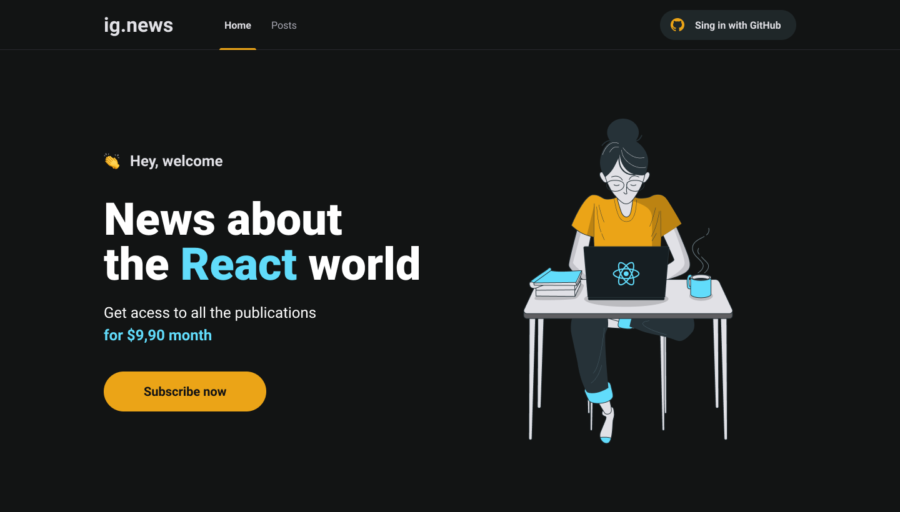

<h1 align="center">
    
</h1>

  <a href="#-tecnologias">Tecnologias</a>&nbsp;&nbsp;&nbsp;|&nbsp;&nbsp;&nbsp;
  <a href="#-projeto">Projeto</a>&nbsp;&nbsp;&nbsp;|&nbsp;&nbsp;&nbsp;
  <a href="#-setup">Setup</a>&nbsp;&nbsp;&nbsp;

 

  

## 🚀 Tecnologias

Esse projeto foi desenvolvido com as seguintes tecnologias:

- [NEXTJS](https://nextjs.org)
- [STRIPE](stripe.com/)

## 💻 Projeto

Projeto criado durante a trilha de ReactJS do Ignite. Este projeto foi construido
com o poderoso framework de ReactJs o NextJS, com a finalidade de aprendizado

---

Feito by André Junior :wave: [portifólio](https://andrejr.dev)